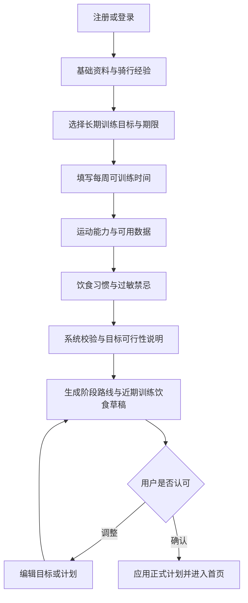
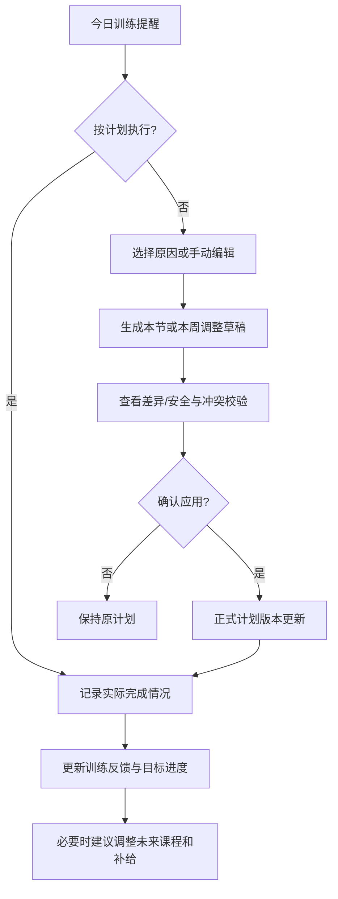

# AI 自适应骑行训练与营养 App｜一期产品需求与开发设计文档（PRD）

> **项目代号**：RidePilot（仅用于开发沟通，非正式产品命名）  
> **文档版本**：V1.0  
> **整理日期**：2026-10-08  
> **面向角色**：产品负责人、UI/UX 设计、客户端开发、后端开发、AI 工程、测试  
> **当前状态**：一期业务方向已确定；文中标记为「建议默认」的实现选择可在技术评审后调整  
> **文档目的**：让兼任产品与开发的项目负责人，可以按模块拆解任务、定义数据和接口、实现与验收一期版本。

---

## 0. 阅读说明与需求确定程度

本文件将内容划分为三种：

- **[已确定]**：来自本次产品讨论，构成一期必须覆盖的方向。
- **[建议默认]**：为了让开发可以开始而给出的具体实现口径；可修改，但修改后需同步接口、数据结构和验收标准。
- **[待决策]**：不影响先开发基础模块，但在正式发布前需要确认的事项。

优先级定义：

- **P0**：一期上线的核心闭环必需。
- **P1**：一期推荐增强，可在 P0 闭环稳定后补齐；不阻塞首个可用版本。
- **P2**：明确预留、暂不实现。

**一期完成的定义**：一位公路车用户可以建立档案 → 设定目标 → 获得带阶段测试的训练计划及配套饮食建议 → 在日历查看和修改课程 → 用快捷交互请求 AI 调整 → 预览差异并确认应用 → 临时新增比赛、自动生成备赛调整草稿 → 记录训练/测试结果 → 获得下一阶段计划建议。此过程不依赖第三方硬件。

---

# 1. 产品概述

## 1.1 产品定位 [已确定]

面向**普通公路车爱好者与专业运动员**的 AI 个性化运动教练。根据个人身体条件、运动能力、训练目标、可用时间、日常作息、实际训练反馈与突发情况，动态制定和调整**骑行训练 + 饮食营养 + 赛事备赛**方案。

**核心价值主张**：让科学训练适应人的实际生活，而不是让人机械地适应固定计划。

**一期聚焦**：公路车训练；基础数据允许手动输入和记录。  
**未来扩展**：跑步、游泳等运动类型；运动平台、码表、功率计、心率设备等数据同步。

## 1.2 需要解决的真实痛点 [已确定]

1. 现成训练计划没有充分考虑个人运动水平、身体条件和生活时间。
2. 临时加班、疲劳、天气或其他情况发生后，很难合理调整后续训练。
3. 长期目标较大时，缺少可执行的阶段目标和测试反馈机制。
4. 训练与饮食、补给脱节。
5. 临时增加、取消或改期比赛时，原本的训练周期容易失效。
6. 专业软件门槛较高；普通用户不熟悉功率、阈值、训练负荷等术语。
7. 纯聊天式 AI 交互效率低，生成的文字计划不易修改和直接使用。

## 1.3 产品原则 [已确定]

1. **专业在底层，简洁在表面**：同一份计划支持简洁和专业视图。
2. **快捷操作优先，自由对话保留**：优先选项、表单、按钮、可视化编辑；开放式 AI 对话作为辅助入口。
3. **目标驱动，而非课程堆砌**：长期目标 → 阶段目标 → 训练周期 → 每日课程 → 阶段测试 → 重新评估。
4. **训练与营养联动**：训练变化引起补给变化时，生成可审阅的营养调整建议。
5. **AI 建议不等于直接生效**：计划先形成草稿，用户预览并确认应用。
6. **安全优先**：大模型输入/输出审核 + 运动规则校验 + 营养规则校验；不能依赖敏感词列表作为唯一防护。
7. **可解释、可修改、可撤销**：说明调整原因，保留版本和恢复能力。
8. **为多运动与设备同步预留接口**：但不将未来功能作为一期交付阻塞项。

## 1.4 用户类型与体验设计

| 用户 | 典型问题 | 默认呈现 | 可选深入能力 |
|---|---|---|---|
| 入门骑行者 | 不知道怎么科学训练 | 今天练什么、练多久、难度如何、吃什么 | 展开运动术语解释、简化能力测试 |
| 规律训练爱好者 | 想提升 FTP、爬坡和耐力 | 周计划、阶段目标、恢复提示 | FTP 区间、结构化间歇、功率趋势 |
| 进阶/专业运动员 | 需要精细化周期安排 | 同一首页和编辑器 | 训练区段、负荷指标、专项测试、周期变化 |

不将「专业用户」设计成单独系统，也不要求用户注册时声明“我是专业运动员”。由用户自主切换简洁/专业视图；视图切换不改变训练内容本身。

## 1.5 目标指标 [建议默认]

上线后重点跟踪：

- 首次建档至**成功应用首份训练计划**的完成率。
- 用户在无需自由输入提示词情况下完成计划调整的比例。
- AI 调整建议的预览 → 应用转化率。
- 用户按时记录训练与阶段测试结果的比例。
- 比赛插入后成功完成计划重新安排的比例。
- 计划版本恢复成功率、AI 建议被安全校验拦截的原因分布。

先建立埋点口径，不在缺少基准数据时承诺具体百分比目标。

---

# 2. 一期范围与边界

## 2.1 一期功能范围

| 编号 | 模块 | 核心能力 | 优先级 |
|---|---|---|---|
| M01 | 用户与运动档案 | 基础资料、骑行能力、作息、设备情况、饮食偏好与禁忌 | P0 |
| M02 | 训练目标 | 长期目标、期限、可行性说明、阶段拆解及阶段调整 | P0 |
| M03 | 训练计划 | AI 初始计划、训练日历、周/阶段训练安排 | P0 |
| M04 | 课程编辑 | 手动编辑、AI 快捷调整、简洁/专业视图、差异预览、一键应用 | P0 |
| M05 | 阶段测试 | 基线测试、阶段测试、结果录入、阶段复评 | P0 |
| M06 | 饮食营养 | 饮食档案、日常建议、训练前中后补给、餐食替换 | P0 |
| M07 | 赛事管理 | 随时新增比赛、A/B/C 赛事优先级、动态备赛及赛后恢复调整 | P0 |
| M08 | 训练反馈 | 完成情况、时长、RPE、疲劳、恢复主观反馈 | P0 |
| M09 | AI 交互与安全 | 引导式交互、自由对话、结构化建议、输入输出审核、规则校验 | P0 |
| M10 | 版本与应用 | 草稿、校验、确认、版本恢复、操作记录 | P0 |
| M11 | 数据分析 | 目标进度、阶段达成、完成率、基础能力趋势 | P0（基础） |
| M12 | 模板与高级图表 | 自定义训练模板、较丰富的功率曲线分析、图表导出 | P1 |
| M13 | 扩展接入 | 第三方硬件、运动平台同步、多种运动、教练协作 | P2 |

## 2.2 一期明确不做

- 直接控制智能骑行台、码表或其他设备。
- 自动同步 Strava、Garmin、Zwift、Apple Health 等第三方平台（数据模型预留 `external_provider`）。
- 内置 GPS 骑行导航、实时竞技排名、社交动态、商城、付费订阅体系。
- 为医疗诊断、疾病治疗或专业临床营养干预提供替代性建议。
- 要求用户必须有功率计才能使用。

## 2.3 一期关键边界

- **AI 是建议产生者，不是最终写入者。** 任何影响正式训练/饮食计划的 AI 结果，都必须经过服务端结构校验和业务校验，再由用户确认。
- **阶段性目标不是结果保证。** 系统呈现目标差距、难度、建议检查点，不承诺“多少周必然提升多少瓦”。
- **运动能力数据可有不同精度。** 有功率计可用 FTP/功率区间；无功率计用时长、RPE、心率（若有）及固定测试记录，需注明不可直接等价。
- **AI 不可覆盖历史实际训练结果。** 修改的是未来计划或计划课程，已完成的训练记录独立保留。

---

# 3. 信息架构与页面设计

## 3.1 一级导航 [建议默认]

底部 5 Tab：

1. **首页**：今天的训练、饮食、近期比赛、目标进度、待处理建议。
2. **训练**：训练日历、课程详情/编辑、阶段计划、目标、阶段测试、比赛事件。
3. **饮食**：今日餐食、营养目标、运动补给、餐食调整。
4. **AI 教练**：快捷指令、引导式调整、自由对话、建议历史。
5. **我的**：个人档案、运动能力、每周时间安排、偏好、安全与隐私设置、未来设备接入入口。

**设计取舍**：目标和赛事属于训练域的二级核心入口；首页提供醒目的目标进度和下一场比赛卡片，避免首版底部导航过多。

## 3.2 主要页面清单

| 页面 ID | 页面 | 必须展示/允许的动作 |
|---|---|---|
| P01 | 欢迎与登录 | 登录/注册、隐私说明 |
| P02 | 初次建档向导 | 目标、能力、训练时间、饮食偏好，支持跳过非必要项 |
| P03 | 首页 | 今日待办、训练/餐食、下一测试、下一比赛、快捷异常调整 |
| P04 | 训练日历 | 周/月视图、训练/比赛/测试/休息事件、冲突标记 |
| P05 | 训练课程详情 | 目标、课程结构、预计时长、强度、编辑与记录完成 |
| P06 | 课程编辑器 | 手动/AI、简洁/专业、可视化课程条、草稿状态 |
| P07 | 计划变更预览 | 前后对比、受影响日期、警告、可选应用范围、一键应用 |
| P08 | 目标中心 | 目标详情、难度说明、阶段时间线、当前进度 |
| P09 | 阶段测试 | 测试类型、准备说明、结果录入、能力复评 |
| P10 | 饮食中心 | 今日营养与餐次、训练补给、替换餐食 |
| P11 | 赛事管理 | 赛事列表、创建/编辑/取消、优先级、备赛预览 |
| P12 | AI 教练 | 快捷行动、可选补充说明、自由问答、安全提示 |
| P13 | 训练反馈 | 实际完成量、主观疲劳、RPE、异常情况 |
| P14 | 我的/设置 | 档案、视图偏好、隐私、安全与设备占位 |

## 3.3 关键交互规范

- 全局状态区分：**正式计划**、**未应用草稿**、**待确认 AI 建议**。
- 用户触发「应用」前显示**变更摘要**，不允许在 AI 回答过程中悄悄覆盖正式计划。
- AI 入口默认展示可点击操作（时间不足、疲劳、天气、改期、替换餐食等），必要时打开自由输入。
- 训练数据在两个视图中共享：视图只改变显示密度和编辑控件，不产生两份课程。
- AI 生成中、失败、超时、建议无效、冲突过期都需要明确状态；失败不能破坏旧计划。

---

# 4. 核心业务流程

## 4.1 首次使用主流程（P0）



**首次建档最少必填 [建议默认]**：成人身份确认、训练目标、每周可用天数/时段、当前训练经验、已有运动数据情况、食品过敏/饮食禁忌确认。身高、体重、FTP、心率、历史训练量等能提高质量，但应允许缺省并标注估算精度。

**生成策略 [建议默认]**：先生成近期 2～4 周可执行日程及长期阶段路线；后续阶段只显示目标和检查点，避免一次生成大量不可维护的日程。

## 4.2 日常训练闭环



## 4.3 阶段测试闭环

长期目标 → 自动拆分阶段 → 每阶段配置能力验证点 → 训练与恢复 → 适当条件下进行测试 → 用户输入/导入测试结果 → AI 结合实际完成度、测试条件及状态评估 → 保留阶段 / 微调 / 延长 / 提前进入下一阶段 → **预览并确认**后更新后续计划。

## 4.4 临时增加赛事闭环

用户在任意日期新增比赛 → 填写比赛重要性和赛道信息 → 判断与既有目标、训练、测试、休息日冲突 → AI 形成赛前/赛后训练与饮食调整草稿 → 对比影响 → 用户修改或选择范围 → 校验 → 应用 → 赛后记录反馈 → 重回长期训练目标。

## 4.5 用户异常情况快捷入口

| 事件 | 用户最少输入 | 系统行为 |
|---|---|---|
| 时间不足 | 今日剩余时间 | 提供缩短/顺延方案，说明训练目标是否变化 |
| 疲劳/睡眠差 | 疲劳程度、是否有明显不适 | 评估降低强度、恢复或取消；危险症状提供安全指引 |
| 天气问题 | 室内设备是否可用 | 室内替代、改期或替换课程 |
| 临时加班/出差 | 受影响日期、新可用时段 | 检查周计划冲突并重排 |
| 某次训练未完成 | 实际完成量、主观难度 | 不机械补练，评估当前周期影响 |
| 临时增加比赛 | 日期、类型、距离、重要性 | 生成备赛/减量/赛后恢复调整草稿 |
| 赛程取消或改期 | 新日期/取消原因 | 重新优化未来计划，不直接回滚至过期日程 |
| 饮食计划不合适 | 不喜欢/买不到/外出就餐 | 在过敏/禁忌约束下替换餐食 |

---

# 5. 模块详细需求与验收口径

## M01. 用户与运动档案（P0）

### 功能需求

- **FR-001** 支持账户注册、登录、退出；同一账户有唯一用户标识。
- **FR-002** 记录基础信息：年龄段、身高、体重（可选且可更新）、训练经验、训练目的。
- **FR-003** 记录骑行能力：FTP（若已知）、阈值心率（可选）、近期每周骑行时长、训练历史来源、数据可信度与测试日期。
- **FR-004** 记录训练条件：每周固定/弹性可用时段、偏好休息日、单次最长时长、室内外设备条件。
- **FR-005** 记录饮食条件：饮食习惯、过敏原、禁忌、偏好、常规用餐时间。
- **FR-006** 支持随时修改资料；重要能力值变化触发「是否重新计算未来训练区间」提示。
- **FR-007** 记录简洁/专业视图偏好，允许随时切换。

### 业务规则

- FTP 未填写时，不能假装已有准确 FTP；以 RPE / 时长为主给出课程并提示进阶测试。
- 身体数据、饮食限制、训练偏好等属于敏感个人数据，应仅收集实现功能所必需的信息。
- 训练可用时段应保留时区；跨时区变更需询问用户是保留本地时间还是绝对时间。

### 验收（AC-M01）

- 未提供功率计、FTP 的用户仍可完成建档和生成基础计划。
- 修改 FTP 后未来课程的相对强度目标可重新计算；已完成训练数据不变。
- 用户切换简洁/专业视图，课程参数保持一致。

## M02. 训练目标与阶段拆解（P0）

### 功能需求

- **FR-101** 新增目标：目标类型（FTP / 爬坡 / 耐力 / 赛事表现 / 自定义）、当前基线、目标值、期望日期、重要性。
- **FR-102** 评估目标难度：差距、期限、可用训练时间、训练经验、数据缺失及不确定性。
- **FR-103** 将大目标拆分为多阶段；每阶段含阶段目的、建议周期、训练侧重点、测试类型、阶段完成条件。
- **FR-104** 支持修改目标/目标日期，暂停或恢复目标。
- **FR-105** 阶段测试后，生成下一阶段建议并明确与原方案的区别。
- **FR-106** 同期多个目标可设置主目标与次目标；出现冲突时需提示。

### 业务规则

- 不使用简单线性公式承诺 FTP 按固定速率增长。阶段示例数值仅是检查点，需根据结果动态调整。
- 目标与赛事可能竞争训练资源；若赛事被设为 A 级，允许暂时优先于长期能力目标，但必须提示并取得确认。
- 目标进度应区别：`数值差距`、`阶段完成进度`、`训练执行进度`，不能将“当前 FTP / 目标 FTP”误称为完成百分比。

### 验收（AC-M02）

- 设定明显激进的短期限目标时，系统能显示不确定性和可调整期限的建议。
- 每个活跃阶段都关联测试或明确的可观察验证指标。
- 用户修改长期目标，不会直接覆盖已有计划，而是生成更新草稿。

## M03. 训练计划与日历（P0）

### 功能需求

- **FR-201** 依据用户画像、活跃目标、可用时间与恢复安排生成初始计划。
- **FR-202** 支持周/月日历；事件类型：训练课程、休息/恢复、阶段测试、比赛。
- **FR-203** 查看训练详情：目标、内容、总时长、强度、区段结构、注意事项。
- **FR-204** 支持调整课程日期；冲突时显示原因并提供替代方案。
- **FR-205** 支持手动标记完成、部分完成、未完成并记录实际结果。
- **FR-206** 展示「正式计划」与「待应用变更」状态。

### 训练课程结构

至少包含：课程标识、运动类型 `cycling`、训练目的、建议日期、预计时长、可选强度基准、若干有序训练区段。

区段类型：`warmup`、`work`、`recovery`、`cooldown`；重复组允许用 `repeat_count` 表达。强度目标可使用 FTP 百分比、绝对功率、心率范围或 RPE；无数据时不强迫生成瓦数。

### 业务规则

- 保存日期和本地时区；明确用户日历的周起始日。
- 不应因周计划发生调整而无差别补齐所有错过的高强度训练。
- 对同一时段的多个高强度课程、测试和比赛做冲突检查。

### 验收（AC-M03）

- 有固定周一/周三跑步等外部时间占用时，系统能避开或按用户允许的规则协调，不擅自覆盖用户时间约束。
- 训练和比赛、阶段测试同时出现时，日历有明确事件标识和冲突提示。
- 已完成的历史训练不随未来计划修改而改变。

## M04. 课程编辑与应用（P0）

### 编辑模式

| 模式 | 简洁视图 | 专业视图 |
|---|---|---|
| 手动编辑 | 调整时长、日期、难度档位、室内/户外、是否保留训练目的 | 增删/排序区段、组数、工作/恢复时长、功率区间、RPE 等 |
| AI 辅助 | 选择“时间不足、疲劳、天气、临时有事、太难”等原因并填写最少字段 | 指定约束、查看参数级差异、训练负荷变化说明，可再手动微调 |

### 功能需求

- **FR-301** 课程详情页进入统一编辑器。
- **FR-302** 手动编辑时实时更新总时长与可视化训练结构。
- **FR-303** AI 快捷调整优先提供选项；「其他情况」可打开自由文本。
- **FR-304** AI 返回 1～3 个结构化候选方案，展示「保留训练目标/改变训练目标」等区别。
- **FR-305** 支持对候选方案局部编辑，不必整份重生。
- **FR-306** 支持差异预览：原计划 → 新计划、受影响日期、课程时长/强度变化、可能的营养调整。
- **FR-307** 支持「仅修改本节」或「联动调整后续计划」；后者必须二次确认影响范围。
- **FR-308** 安全/冲突校验不通过时禁止直接应用，提供原因。
- **FR-309** 应用成功后创建新版本，支持恢复上一正式版本。
- **FR-310** 课程草稿离开页面时提示保存/放弃（自动保存可在 P1 增强）。

### 状态流转

`正式计划 → 创建草稿 → 手动编辑/AI 建议 → 待校验 → 可应用/需修改/不可应用 → 用户确认 → 新正式版本`

AI 建议始终处于草稿分支，不允许绕开应用接口直接写数据库中的生效课程。

### 验收（AC-M04）

- 简洁视图修改训练时长后，专业视图立即显示对应的实际区段；反向操作也成立。
- AI 将阈值训练改成低强度骑行时，明确提示训练目的发生变化。
- 取消预览或关闭建议不改变已应用计划。
- 客户端重复点击「应用」不会生成多份正式版本。
- 在预览期间若正式计划被其他动作修改，旧草稿应用时检测版本冲突并要求重新预览。

## M05. 能力测试与阶段复评（P0）

### 功能需求

- **FR-401** 支持初始基线测试和阶段测试事件。
- **FR-402** 依用户设备条件推荐合适测试方式：功率能力测试、标准化持续输出测试、固定路线表现、RPE/心率辅助评估等。
- **FR-403** 测试前呈现准备条件、强度、适用范围及不建议测试的状态。
- **FR-404** 支持录入测试日期、测试类型、结果、设备来源、主观感受和测试条件。
- **FR-405** 生成阶段复评结论：达到预期、证据不足、进度较慢、可提前调整等。
- **FR-406** 根据复评生成下一阶段计划草稿，保留用户审核过程。
- **FR-407** 允许推迟、跳过或标记测试无效，并记录原因。

### 业务规则

- 临时疲劳、生病、明显不适时不强制极限测试；必须有推迟或恢复路径。
- 单次异常成绩不直接判断能力永久下降；结合测试条件和历史记录说明可信度。
- 不同测试协议得出的值不得不加说明地直接横向比较。

### 验收（AC-M05）

- 完成测试后可以看到“结果 → 阶段结论 → 后续计划影响”。
- 延期测试时，相关阶段检查点及未来课程有清晰变化预览。
- 未完成测试也允许继续使用 App，不会卡死目标系统。

## M06. 饮食与训练补给（P0）

### 功能需求

- **FR-501** 录入饮食偏好、过敏原、禁忌、用餐习惯和常见食物。
- **FR-502** 根据训练日/休息日、训练时长与强度、个人条件生成可执行的每日饮食建议。
- **FR-503** 根据较长或较高强度课程生成训练前、训练中、训练后补给建议。
- **FR-504** 支持餐食替换：不喜欢、食材缺失、外出就餐、准备时间有限。
- **FR-505** 支持用户手动修改餐食、份量和用餐时间。
- **FR-506** 训练变化导致补给安排可能改变时，生成待确认联动建议。
- **FR-507** 新增赛事时生成赛前、比赛中与赛后补给建议。
- **FR-508** 显示营养数值的来源/估算属性，避免精确度伪装。

### 业务规则

- 严格排除用户已声明的过敏食物和禁忌；无法确认成分时必须提示核对标签。
- 营养计划不以极端限能、快速脱水、危险补剂或有害减重为目标。
- 未提供足够数据时，优先给出一般性的食物组成和补给安排；不自动编造精确热量、糖原储备或身体组成。
- 医疗状况、特殊饮食疾病需求、药物相互作用等应进入保守/转专业人员处理路径。
- 训练修改后不直接覆盖饮食计划；通过联动草稿由用户选择是否应用。

### 验收（AC-M06）

- 含有过敏原的餐食不得进入可应用计划（如果来源数据标注不完整，需要提示风险并阻止自动确认）。
- 长骑改成休息后，系统可以建议相应调整运动补给，但不会无授权改变用户已记录的实际进食。
- 替换食谱后保留用户偏好和禁忌约束。

## M07. 赛事与动态备赛（P0）

### 功能需求

- **FR-601** 任何时间都可以新增赛事：名称、日期/时区、类型、距离、预计爬升（可选）、重要性、参赛意图。
- **FR-602** 赛事优先级 A/B/C：核心目标赛 / 重要比赛 / 训练型比赛；简洁视图使用自然语言描述。
- **FR-603** 识别比赛对现有目标、训练周期、阶段测试、休息与饮食的影响。
- **FR-604** 生成赛前专项训练或减量、比赛日计划、赛后恢复的调整草稿。
- **FR-605** 允许比赛改期、取消、优先级变化；产生新预览而不是直接修改既有计划。
- **FR-606** 多场赛事冲突时提示优先级及恢复时间问题。
- **FR-607** 支持赛后记录结果、用时、主观表现、疲劳，并建议回归长期目标的路径。

### [建议默认] 时间窗口策略（仅作为 AI 规划初步启发，非医学或训练硬阈值）

- 距离比赛较远：可安排专项准备并重新评估阶段计划。
- 中短期临时新增：保留收益较高的课程，调整疲劳管理与测试安排。
- 比赛非常临近：不追求短期大幅提高体能，重点考虑休息、状态和补给。
- 比赛之后：以实际比赛负荷和恢复状态决定返回强度训练的时机。

最终方案仍需结合运动员级别、比赛目标、已有疲劳及可用时间，不能单靠距离比赛的天数生成固定处方。

### 验收（AC-M07）

- 在已有有效训练计划中插入 6 天后的比赛，会出现受影响课程、阶段测试及饮食建议的对比预览。
- 删除比赛后，不直接恢复早已过期的历史日程，而是重新生成当前可执行草稿。
- 比赛与高强度训练同日冲突时明确提示并阻止无提示覆盖。

## M08. 训练记录与反馈（P0）

### 功能需求

- **FR-701** 支持训练标记：完成、部分完成、跳过。
- **FR-702** 支持实际时长、距离（可选）、功率/心率（可选）、主观用力 RPE、疲劳、睡眠/恢复主观评价、异常情况记录。
- **FR-703** 记录与课程计划的差异，供阶段复评使用。
- **FR-704** 当连续无法完成计划或显著疲劳时，推荐用户进行恢复评估或调整，而非直接提高负荷。
- **FR-705** 对训练总量、完成率、状态趋势给出基础视图。

### 业务规则

- 没有功率数据时，可展示训练时长、RPE、计划完成率等，不能伪造基于功率的 TSS。
- 训练实际记录与计划课程分表/分实体保存；历史记录只能经显式编辑记录本身的动作更正。

### 验收（AC-M08）

- 部分完成的课程允许保留真实完成量，同时将后续调整生成为独立建议。
- 没有任何第三方设备时，用户仍可以完整记录与查看训练历史。

## M09. AI 交互、内容审核与安全校验（P0）

### 功能需求

- **FR-801** 用户可以通过快捷按钮/选项完成大多数 AI 调整操作。
- **FR-802** 保留独立「AI 教练」自由对话页和场景内补充说明入口。
- **FR-803** AI 响应以结构化数据返回：行动类型、调整原因、建议课程/饮食、差异摘要、风险标识、用户待确认项。
- **FR-804** 输入先执行内容安全检测，输出先执行结构校验与安全/业务规则校验，再展示或进入可应用状态。
- **FR-805** 高风险情境有清晰的阻断、降级、安全提示机制。
- **FR-806** 记录 AI 模型版本、提示词模板版本、规则版本、建议结果及最终用户操作（避免保存不必要的原始敏感文本）。
- **FR-807** 模型失败或超时时，现有正式计划不变，允许重试与手动修改。

### 交互分层

1. **快捷行动**（主入口）：时间不足、疲劳、天气、改日期、换餐、增加比赛。
2. **引导式参数**：当快捷行动仍缺关键信息时，用选择器、滑杆、日期组件收集。
3. **自由对话**（保留）：复杂需求、咨询训练原理、解释当前方案。自由文本不得直接写入正式计划。

### 安全要求

采用多层防护，**不以单一敏感词表“黑名单”代替安全审核**：

- **输入层**：违规或明显危险请求、提示词注入、跨用户信息索取等风险识别。
- **模型层**：限定服务领域、禁止越权指令、提供训练与营养安全约束。
- **输出层**：语义审核，防止危险训练处方、极端节食、危险补给建议与不当医疗诊断。
- **结构层**：JSON Schema / 类型检查、完整性、数值范围、对象权限校验。
- **业务层**：训练负荷和恢复规则、用户过敏/饮食禁忌、课程时长、日期冲突、赛事优先级。
- **用户层**：重要变更必须展示预览并确认应用；记录版本和撤销能力。

健康风险示例：若用户报告胸痛、晕厥、严重不适等，优先提示暂停训练并寻求适当医疗帮助；不继续自动生成高强度训练方案。审核策略需要允许正常讨论健康知识，避免因“体重”“热量”等普通词汇误伤正常对话。

### 验收（AC-M09）

- 正常的「今天很累，能否把 90 分钟课程改成恢复骑？」可以通过。
- 诱导系统跳过规则或修改他人计划的提示无法执行。
- AI 输出缺字段、无效参数或违反饮食禁忌时，无法成为可应用计划。
- AI 接口错误、限流或超时不影响正式日历查看与手动编辑。

## M10. 版本管理、预览与一键应用（P0）

### 功能需求

- **FR-901** 所有 AI 或手动跨课程调整先形成草稿。
- **FR-902** 比较原版本和草稿：新增、删除、移动、变更的课程及餐食、阶段测试、比赛关联。
- **FR-903** 根据不同维度提示冲突、目标变化与潜在风险。
- **FR-904** 用户明确选择应用范围后，统一写入新的正式计划版本。
- **FR-905** 保存旧版本，可恢复；恢复属于新一次版本变更，而不是删除审计记录。
- **FR-906** 支持版本冲突检测和请求幂等。

### 应用规则

1. 草稿绑定 `base_plan_version`。
2. 申请应用时服务端再次校验权限、过敏规则、训练规则及并发版本。
3. 通过后在事务中写入计划新版本及关联变更，并记录操作者与来源。
4. 对营养变化可独立勾选是否一起应用；未勾选应仍保留旧饮食计划并显示不一致提醒。
5. 成功后返回新的 `plan_version`；失败不可出现训练计划更新成功但版本历史缺失的半成品状态。

### 验收（AC-M10）

- 连续重复提交同一应用请求只生效一次。
- 同一用户两个设备/页面编辑同一版本时，过时草稿不能静默覆盖新版。
- 可以恢复到先前内容，且回滚操作有新的审计条目。

## M11. 目标与成长分析（P0 基础、P1 增强）

- 展示长期目标、当前活跃阶段、阶段测试时间、关键指标趋势。
- 分开呈现：目标值变化、课程完成率、测试结果、运动训练量。
- 数据来源标注「用户手填」「测试结果」「设备数据（未来）」及时间。
- 不做无依据的“精确预测达标日期”；可提供带不确定性描述的规划提示。

---

# 6. 关键页面的详细交互状态

## 6.1 首页（P03）

从上到下建议布局：

1. **今日状态**：日期、是否有安排、快捷反馈（状态良好/一般/疲劳）。
2. **今天的训练卡**：类型、时间、简洁训练说明；`开始/查看`、`调整`、`记录完成`。
3. **今天的饮食卡**：餐次、运动补给提醒、`替换餐食`。
4. **目标进度卡**：当前阶段、下一次测试、目标差距。
5. **下一场比赛卡**：比赛日期与备赛状态（无比赛时隐藏）。
6. **待处理 AI 建议**：包含草稿数量、预览和取消入口。

首页只展示行动导向的信息；完整专业图表移至训练/分析二级页。

## 6.2 训练编辑器（P06）

### 简洁视图

- 输入：训练时间选择、强度档位、日期、训练场景、是否保留训练目的。
- 结果：可视化区段条 + 总时长 + 通俗说明。
- 动作：`AI 调整` / `手动调整` / `查看差异`。
- 原训练目的无法保持时，显示明显提醒，而不是仅替换标题。

### 专业视图

- 输入：训练区段列表，支持增删、复制、调整顺序、组数、工作/恢复时长、功率/心率/RPE 目标。
- 反馈：课程时长、功率区间、区段结构、估算训练负荷（有足够数据时）。
- 动作与简洁视图保持一致；切换视图不重置编辑草稿。

### 未保存/异常

- 返回时：`保留草稿` / `放弃` / `继续编辑`。
- AI 生成失败：允许修改当前草稿并重试，不清空已编辑内容。
- 服务端校验失败：错误定位到具体区段/日期/餐食，并提供可操作建议。

## 6.3 计划变更预览（P07）

必须至少出现：

- **改动原因**：用户主动编辑 / AI 基于何种条件建议。
- **影响范围**：本课程、未来一周、本阶段、赛事备赛。
- **差异清单**：原日期/强度/时长 → 新日期/强度/时长。
- **影响说明**：训练目的改变、可能增加或减少训练量、休息和阶段测试变动。
- **营养关联**：是否建议更新训练补给/饮食安排。
- **安全提示**：警告是否必须确认、是否阻断应用。
- **操作**：继续编辑、取消、确认一键应用。

## 6.4 赛事创建（P11）

第一屏最少：比赛日期、类型、距离、目标重要性。  
第二步可选：赛道爬升、预计强度/时长、比赛地点与时区、是否涉及出行。  
提交后进入「受影响计划预览」，不直接使草稿生效。

## 6.5 阶段测试详情（P09）

需显示：测试目的、适用条件、步骤/时长、需要的设备、应暂停测试的情形、录入项、结果可信度、后续阶段建议。测试可以延期，延期可能影响目标时间线。

---

# 7. 训练计划与营养规划的决策规则

## 7.1 业务输入清单

| 数据分类 | 关键字段 | 缺失处理 |
|---|---|---|
| 身体与习惯 | 年龄段、体重（可选）、训练经验、睡眠/恢复主观状态 | 尽量按保守信息生成，提示进一步完善 |
| 运动能力 | FTP、心率能力、RPE、最近训练量、测试历史 | 无 FTP 不输出未经测定的精确功率区间 |
| 目标 | 类型、目标值、期限、优先级、阶段 | 如期限过激，给出风险和替代路线 |
| 时间约束 | 可用天、时段、休息日、单次时长、临时占用 | 不覆盖硬性不可训练时段 |
| 赛事 | 日期、重要性、赛道/距离、预期目标 | 缺赛道信息时声明估计边界 |
| 饮食 | 过敏、禁忌、习惯、可获取食材、用餐时段 | 过敏和禁忌未知时要求确认关键项 |
| 实际反馈 | 完成度、RPE、疲劳、跳过原因、测试结果 | 数据不足时降低建议自信度 |

## 7.2 规则引擎与 LLM 职责分离

**确定性规则引擎负责**：

- 时段占用与日期冲突。
- 训练结构合法性、区段时长和数值范围。
- 明显负荷/恢复冲突（阈值可配置，不能只靠一个固定公式）。
- 数据来源、权限和版本校验。
- 食品过敏与禁忌校验。
- 草稿状态及计划原子性应用。

**LLM 负责**：

- 理解用户需求和自由文字补充。
- 提议目标拆解、课程变化、异常情况应对、营养与备赛建议。
- 在结构化候选方案间解释取舍。
- 对训练反馈进行可解释总结。

**核心约束**：模型不拥有直接修改正式计划的数据权限；模型建议必须经过结构、权限、数值和安全规则校验。

## 7.3 典型优先级与冲突策略 [建议默认]

1. 用户健康安全与明确的硬性时间约束优先。
2. 已确认的重要比赛日期不可被训练课程覆盖。
3. 已确认过敏/禁忌必须满足。
4. 当前 A 级赛事可作为短期训练主目标，但对长期目标的影响必须解释。
5. 已排定阶段测试可由用户推迟，不与比赛和异常高疲劳强行冲突。
6. 高训练价值并不自动优先于恢复。
7. 若多个解法合理，向用户提供可选择的方案，而不是隐藏取舍。

## 7.4 训练负荷指标 [建议默认]

- 有功率数据：可计算适用的功率区间和训练负荷估算，需明确计算方法、输入质量和版本。
- 无功率数据：可采用 `session-RPE × 实际训练分钟` 形成**内部相对负荷**辅助趋势判断，不把该值标记为功率 TSS。
- 训练负荷的估算不是伤病预测结论；异常时使用保守提示并结合主观状态。

## 7.5 阶段规划规则

- 阶段应存在可观察的目标和评估条件。
- 阶段结束后的动作至少包含：继续、提前调整、延长、降级恢复、目标重估。
- AI 应说明测试结果是否具有可比性（设备、协议、身体状态、路线条件）。
- 目标很大时默认拆分多个阶段，**阶段时间和能力数值不作线性保证**。

---

# 8. 推荐技术架构（可进入开发的默认方案）

> 本节是**[建议默认]**，技术栈非用户已确认。若项目已有框架，可保留职责分层而替换语言与库。

## 8.1 整体分层

```text
移动端 App（简洁/专业视图，结构化编辑，日历与本地草稿）
        |
        | HTTPS / JSON
        v
业务 API（身份鉴权、档案、目标、计划、课程、赛事、饮食、记录）
        |
        +-- 计划服务（版本、草稿、事务应用、差异计算）
        +-- 规则校验服务（训练、饮食、时间、权限）
        +-- AI 编排服务（场景模板、模型适配、安全审核、JSON Schema）
        +-- 统计分析服务（训练量、目标、阶段表现）
        |
        v
PostgreSQL（结构化业务数据与版本快照）
        + Redis/任务队列（异步生成与重试，可后加）
        + 对象存储（未来活动文件/设备同步原始数据）
```

## 8.2 技术栈建议

| 层 | 建议 | 理由 |
|---|---|---|
| App | React Native + TypeScript（可选 Expo） | 跨平台与组件复用；若优先 Web 可先 PWA 原型再转 App |
| 后端 | Node.js + TypeScript，建议 NestJS / Fastify 二选一 | 易共享类型定义、适合模块化 API |
| 数据库 | PostgreSQL | 关系模型、事务、版本、JSONB 配合使用 |
| 缓存/异步 | Redis + 任务队列（按规模启用） | AI 任务状态、限流与后台异步计算 |
| AI 层 | 独立 Provider Adapter + JSON Schema 约束 | 替换模型无需改业务逻辑 |
| API 文档 | OpenAPI 3.x | 自动生成类型与接口联调 |
| 监控 | 服务端日志、错误追踪、关键指标埋点 | 排查 AI 失败、安全校验与应用冲突 |

**不要让客户端直接持有大模型 API Key**。大模型请求应由服务端统一鉴权、构建上下文、审核、校验、记录请求结果与费用。

## 8.3 前端建议模块目录

```text
src/
  app/                  # 路由与全局布局
  features/
    onboarding/         # 建档向导
    profile/            # 个人运动档案
    goals/              # 长期目标与阶段
    calendar/           # 计划日历
    workouts/           # 课程详情、简洁/专业编辑器
    assessments/        # 阶段测试
    nutrition/          # 饮食、补给、替换
    races/              # 赛事
    training-logs/      # 完成反馈
    ai-coach/           # 快捷 AI 交互、自由聊天
    plan-revisions/     # 差异、确认、版本恢复
  shared/
    api/                # OpenAPI 生成客户端
    components/         # 设计系统
    stores/             # 用户偏好和临时 UI 状态
    utils/              # 时间、单位和展示格式
```

## 8.4 后端建议模块

- `auth`：认证授权与用户访问边界。
- `profiles`：身体、能力、作息、饮食偏好。
- `goals`：目标、阶段、目标优先级。
- `plans`：计划版本、草稿、差异与应用。
- `workouts`：结构化课程及编辑。
- `assessments`：测试及阶段复评。
- `nutrition`：饮食/补给及禁忌规则。
- `races`：赛事及备赛影响评估。
- `activities`：实际训练与状态反馈。
- `ai-orchestrator`：上下文组装、内容审核、模型调用、结果校验。
- `analytics`：趋势与成长分析。

**一期开发建议先做模块化单体**，不急于拆微服务；保持清晰接口和领域边界即可。

---

# 9. 核心数据模型（逻辑级，供建表使用）

字段名称为建议，可转成数据库 Migration 与 TypeScript 类型。所有业务实体均应具有 `id`、`user_id`（或通过父实体继承）、`created_at`、`updated_at`；日期时间统一以 UTC 存储并保留业务时区。

| 实体/表 | 关键字段 | 说明 |
|---|---|---|
| `users` | `id`, `auth_identity`, `timezone`, `locale`, `status` | 账户 |
| `athlete_profiles` | `user_id`, `height_cm`, `weight_kg`, `experience_level`, `equipment_flags`, `view_preference` | 运动档案 |
| `ability_measurements` | `user_id`, `metric_type`, `value`, `unit`, `measured_at`, `source`, `protocol`, `confidence` | FTP 等能力值历史，不能只在 profile 中覆盖 |
| `availability_rules` | `user_id`, `weekday`, `start_local`, `end_local`, `rule_type`, `timezone`, `valid_from`, `valid_to` | 固定/弹性时段与不可用时间 |
| `wellness_checkins` | `user_id`, `local_date`, `fatigue`, `sleep_quality`, `readiness`, `symptom_flags` | 用户主动提交的状态 |
| `goals` | `user_id`, `type`, `baseline`, `target`, `deadline`, `priority`, `status` | 长期目标 |
| `goal_stages` | `goal_id`, `order`, `start_date`, `end_date`, `objectives`, `success_criteria`, `status` | 阶段路线 |
| `assessments` | `user_id`, `stage_id`, `scheduled_at`, `protocol`, `status`, `result`, `conditions` | 测试与结果 |
| `races` | `user_id`, `name`, `starts_at`, `timezone`, `type`, `distance_km`, `elevation_m`, `priority`, `status` | 比赛事件 |
| `training_plans` | `user_id`, `goal_id`, `active_version_id`, `status` | 逻辑计划 |
| `plan_versions` | `plan_id`, `version_no`, `base_version_id`, `change_reason`, `snapshot`, `applied_at` | 不可变正式版本快照 |
| `plan_items` | `plan_version_id`, `event_type`, `scheduled_start`, `scheduled_end`, `reference_id`, `status` | 训练/测试/比赛/恢复日历投影 |
| `workouts` | `plan_version_id`, `sport_type`, `purpose`, `title`, `target_duration_min`, `intensity_basis`, `structure` | 计划课程快照 |
| `training_activities` | `user_id`, `planned_workout_id`, `actual_started_at`, `actual_duration_min`, `distance_km`, `rpe`, `status`, `notes`, `source` | 实际训练记录，与计划分离 |
| `nutrition_profiles` | `user_id`, `diet_preferences`, `allergens`, `restrictions`, `meal_schedule` | 饮食资料 |
| `nutrition_plans` | `user_id`, `start_date`, `end_date`, `plan_version`, `status` | 饮食计划 |
| `nutrition_items` | `nutrition_plan_id`, `date`, `meal_type`, `foods`, `portions`, `estimated_nutrients`, `linked_workout_id` | 餐次和运动补给 |
| `change_proposals` | `user_id`, `base_version_id`, `proposal_type`, `status`, `operations`, `risk_flags`, `explanations`, `expires_at` | 待审阅建议，AI 与手动均使用 |
| `proposal_validations` | `proposal_id`, `ruleset_version`, `passed`, `warnings`, `blockers`, `validated_at` | 校验结果 |
| `audit_events` | `user_id`, `entity_type`, `entity_id`, `action`, `actor`, `metadata`, `occurred_at` | 操作审计 |
| `ai_request_logs` | `user_id`, `scene`, `model_id`, `prompt_version`, `status`, `token_usage`, `latency_ms`, `safety_result` | 模型治理；敏感文本按最小化原则处理 |

## 9.1 推荐状态枚举

- 目标：`draft | active | paused | achieved | closed`。
- 阶段：`planned | active | completed | deferred | cancelled`。
- 比赛：`planned | confirmed | cancelled | completed`。
- 测试：`scheduled | completed | postponed | skipped | invalid`。
- 课程执行：`scheduled | completed | partial | skipped`。
- 建议草稿：`draft | generating | pending_validation | ready | blocked | applied | rejected | expired`。

## 9.2 Workout 结构示例

以下仅示例数据格式，不是给某一具体用户的训练处方：

```json
{
  "id": "workout_001",
  "sport_type": "cycling",
  "title": "阈值训练",
  "purpose": "improve_threshold",
  "intensity_basis": "ftp_percent",
  "segments": [
    { "id": "s1", "type": "warmup", "duration_sec": 600, "target": { "kind": "ftp_percent", "min": 50, "max": 65 } },
    { "id": "s2", "type": "work", "duration_sec": 900, "target": { "kind": "ftp_percent", "min": 92, "max": 95 } },
    { "id": "s3", "type": "recovery", "duration_sec": 300, "target": { "kind": "ftp_percent", "min": 45, "max": 55 } },
    { "id": "s4", "type": "work", "duration_sec": 900, "target": { "kind": "ftp_percent", "min": 92, "max": 95 } },
    { "id": "s5", "type": "cooldown", "duration_sec": 600, "target": { "kind": "ftp_percent", "min": 40, "max": 55 } }
  ]
}
```

课程总时长由各区段派生计算，勿同时将两个互不一致的字段作为事实来源。使用 `repeat_count` 时需先展开计算，再进行总时长校验。

## 9.3 可拓展性约束

- 运动类型统一 `sport_type`，一期仅实现 `cycling`。
- 不要在核心课程表中只存 `power_watt`；使用可扩展的 `target.kind`。
- 能力指标应记录值、单位、测量时间、来源与测试协议。
- 第三方数据未来通过 `external_provider` / `external_id` 映射，不以第三方 ID 作为主键。
- 饮食计划与训练计划分别版本化，但一次应用操作可以保存二者的关联变更记录。

---

# 10. API 设计草案（REST，P0）

以下为接口契约方向。实际请求/响应结构在编码前用 OpenAPI 固化，统一采用带版本字段的资源对象与标准错误格式。

| 方法 | 路径 | 作用 |
|---|---|---|
| `POST` | `/api/v1/auth/...` | 登录/注册（可交由认证服务实现） |
| `GET/PUT` | `/api/v1/me/profile` | 读取/更新运动档案 |
| `GET/PUT` | `/api/v1/me/availability` | 时间偏好与约束 |
| `POST` | `/api/v1/goals/evaluate` | 目标难度评估草稿 |
| `POST` | `/api/v1/goals` | 创建目标 |
| `GET` | `/api/v1/goals/:id` | 目标与阶段详情 |
| `POST` | `/api/v1/plans/generate-proposal` | 生成近期计划 + 阶段路线建议 |
| `GET` | `/api/v1/plans/active` | 当前正式训练计划 |
| `GET` | `/api/v1/calendar?from=&to=` | 查询训练/测试/赛事日历 |
| `GET` | `/api/v1/workouts/:id` | 课程结构与详情 |
| `POST` | `/api/v1/workouts/:id/edit-proposal` | 手动编辑转成统一提案 |
| `POST` | `/api/v1/workouts/:id/ai-adjust` | AI 生成课程调整提案 |
| `POST` | `/api/v1/assessments` | 安排测试 |
| `POST` | `/api/v1/assessments/:id/result` | 保存测试结果与触发复评建议 |
| `GET/POST/PUT` | `/api/v1/races` | 比赛列表/新增/更新（具体可拆 REST 资源） |
| `POST` | `/api/v1/races/:id/replan-proposal` | 因赛事生成计划变更提案 |
| `GET/PUT` | `/api/v1/nutrition/profile` | 营养偏好与禁忌 |
| `GET` | `/api/v1/nutrition/plan?date=` | 指定日期饮食计划 |
| `POST` | `/api/v1/nutrition/meal-swap-proposal` | 餐食替换提案 |
| `POST` | `/api/v1/activities` | 记录实际训练 |
| `GET` | `/api/v1/proposals/:id` | 查看完整提案与差异 |
| `POST` | `/api/v1/proposals/:id/validate` | 对当前数据重新校验 |
| `POST` | `/api/v1/proposals/:id/apply` | 用户确认应用；带幂等键与基础版本 |
| `POST` | `/api/v1/plans/versions/:id/restore-proposal` | 生成版本恢复提案 |
| `POST` | `/api/v1/ai/chat` | 自由对话（不能直接应用计划） |

## 10.1 应用接口契约示例

```json
{
  "proposal_id": "proposal_123",
  "expected_base_version": 7,
  "apply_scope": "current_week",
  "apply_related_nutrition": true,
  "idempotency_key": "client-generated-unique-id"
}
```

返回示例：

```json
{
  "success": true,
  "new_plan_version": 8,
  "affected_dates": ["2026-10-13", "2026-10-15"],
  "nutrition_applied": true
}
```

**建议错误码**：

- `VALIDATION_FAILED`：区段或规则校验失败。
- `SAFETY_BLOCKED`：危险建议被拦截。
- `PLAN_VERSION_CONFLICT`：草稿基于过期版本。
- `PROPOSAL_EXPIRED`：建议已过期。
- `INSUFFICIENT_PROFILE`：缺少影响安全或可执行性的关键信息。
- `AI_UNAVAILABLE`：模型不可用（允许保留手动操作）。
- `FORBIDDEN`：未授权访问其他用户内容。

## 10.2 AI 提案结构（核心契约）

统一提案结构建议如下：

```json
{
  "proposal_type": "workout_adjustment",
  "base_plan_version": 7,
  "reason": "time_constraint",
  "summary": "缩短本次课程，保留一部分阈值刺激",
  "changes": [
    {
      "operation": "replace_workout",
      "target_id": "workout_001",
      "before_ref": "workout_001@v7",
      "after": { "sport_type": "cycling", "purpose": "improve_threshold", "segments": [] }
    }
  ],
  "affected_domains": ["training", "nutrition"],
  "warnings": ["本次训练总量减少，阶段刺激可能与原计划不同"],
  "requires_confirmation": true
}
```

示例中的 `segments: []` 仅占位，**正式校验必须拒绝需要区段但区段为空的课程**。不得直接把模型返回的任意 JSON 作为数据库更新语句；`operation` 必须来自白名单、`target_id` 必须通过当前用户权限与版本校验。

### AI 调用协议建议

`场景标识 + 当前用户约束 + 允许修改的资源范围 + 精简训练上下文 → 输入审核 → 提示模板 → LLM 结构化候选 → 输出审核 → JSON Schema → 业务规则 → 差异摘要 → 草稿待确认`

安全与隐私注意：模型只获得完成任务所需的最小上下文；不要把全部历史聊天、完整身体隐私资料无差别发送给模型。AI 响应要有超时、重试、费用和并发上限。

---

# 11. 业务逻辑与边界场景矩阵

| 场景 | 预期行为 | 是否直接生效 |
|---|---|---|
| 用户当天只有 30 分钟，原课程 90 分钟 | 建议压缩/顺延，说明训练目标变化 | 否 |
| 用户连续两次无法完成高强度训练 | 询问恢复与实际完成原因，生成保守调整建议 | 否 |
| FTP 值更新 | 重新计算未来目标功率并预览 | 否 |
| 新增 6 天后的重要比赛 | 生成赛前安排、相关测试调整、补给和赛后恢复草稿 | 否 |
| 已有两场相近的 A 级比赛 | 提示优先级和恢复冲突，要求用户确认赛事重要性 | 否 |
| 删除下周比赛 | 重新规划而非恢复历史过期训练 | 否 |
| 比赛延期且与阶段测试冲突 | 提供测试顺延/替代评估方案 | 否 |
| 用户要求生成包含已知过敏食材的餐食 | 拦截或替换，提示原因 | 否 |
| AI 响应非法 JSON | 标记失败，不进入可应用状态 | 否 |
| 两个终端同时修改计划 | 版本检查冲突，重新预览 | 否 |
| 用户撤销最近一次应用 | 形成恢复提案并留下审计记录 | 确认后 |
| 无 FTP 和心率数据的用户 | 用可用数据生成基础训练与评估路径 | 首次计划仍需确认 |
| 模型暂时不可用 | 允许浏览正式计划、手动编辑与记录训练 | 手动调整确认后 |
| 用户报告明显危险身体症状 | 不继续安排高强度训练，给出安全提示 | 否 |

---

# 12. 非功能性需求

## 12.1 安全与隐私（P0）

- 身份认证、服务端权限校验；所有按用户隔离的实体都需校验资源归属。
- HTTPS 传输；数据库敏感数据控制访问权限，必要字段加密；密钥保存在服务端密钥管理系统。
- 用户能查看、修改个人资料，并提供导出/删除数据的产品路径（具体保留周期按实际适用法规制定）。
- 记录用户对 AI 功能和敏感健康/饮食数据使用的授权情况；隐私政策明确第三方模型处理说明。
- 不在日志中默认记录完整的过敏、身体状态或自由聊天文本；采用脱敏、最小保留和权限控制。
- 对 AI 输入/输出及计划应用接口实施限流、异常告警和审计。
- 上线前明确适用市场、年龄范围与健康免责声明；特殊健康情况采用保守策略。

## 12.2 可靠性（P0）

- AI 生成操作可能较慢：展示可取消的生成状态；后端建议以可查询的任务/提案状态支撑重试。
- 对外展示的正式计划必须随时可读取；AI 服务不可用时不影响已存数据。
- 应用操作使用数据库事务、乐观锁/版本号和幂等键。
- 对用户操作提供清晰的错误消息，不用“未知错误”替代可理解原因。

## 12.3 性能目标 [建议默认，需实测确认]

- 日历和已缓存正式计划：优先让常见读操作达到流畅体验。
- AI 生成是异步、可查询状态的操作，不要求像普通表单一样立即响应。
- 大型训练计划按日期范围分页或分段拉取，避免一次加载全部阶段的课程详情。
- 分析统计可以异步聚合，避免影响计划应用接口。

## 12.4 国际化与单位

- 一期 UI 使用中文，内部时间、长度、功率、重量、能量单位明确约定。
- 时区是一级数据；比赛可能发生在不同于用户当前时区的地点。
- 日期与赛事时间要展示当地时间，避免跨时区比赛错排。

## 12.5 可观测性

关键事件：`onboarding_completed`、`goal_created`、`plan_proposed`、`proposal_validated`、`proposal_applied`、`proposal_rejected`、`workout_completed`、`assessment_recorded`、`race_created`、`nutrition_swapped`、`ai_safety_blocked`。

日志关联统一 `request_id`、`user_id`（内部伪匿名标识）、`proposal_id`、`plan_version`，便于从 AI 建议追溯到最终是否应用。

---

# 13. 设计系统与视觉要求

## 13.1 风格定位 [已确定方向，具体样式待设计]

**现代运动科技 + 智能极简 + 健康管理亲和感**。避免过度密集、过度专业的默认首页，同时为进阶用户提供清晰的数据视图。

## 13.2 UI 规范建议

- 支持浅色与深色主题，默认可从系统主题读取。
- 训练类型与负荷强度使用稳定的视觉语义，不只依赖颜色，需配文字或图标。
- 重点动作始终明确：`查看`、`调整`、`预览`、`确认应用`、`取消`。
- 主要数据卡同时展示单位与来源；专业术语有轻量解释入口。
- 复杂计划差异使用「变更项清单 + 训练日历高亮」，避免用户从大段文字理解差异。
- 同一课程在简洁/专业视图中的 `workout_id` 与草稿 ID 必须一致。

## 13.3 需要设计的核心组件

- GoalCard：长期目标、阶段进度、下一次测试。
- WorkoutCard：训练时间、类型、强度、快捷调整。
- WorkoutTimeline：区段图；支持专业视图编辑。
- AdjustmentWizard：事件原因选择与所需参数填写。
- ChangeDiff：新旧课程、阶段测试、饮食变化清单。
- RaceCard：赛事优先级、剩余天数和备赛状态。
- NutritionMealCard：餐次/补给/替换入口。
- SafetyAlert：一般提示、需确认警告、不可应用阻断。
- DraftStatusBar：未应用草稿、版本来源与生效状态。

---

# 14. 开发实施顺序与任务拆分

> 以依赖关系排序，而非固定日历工期。每一阶段都要能独立演示和回归测试。

## 阶段 A：基础工程与领域模型

**交付**：项目骨架、用户登录、数据库迁移、统一数据实体与版本系统雏形。

- [ ] 客户端路由/主题/通用组件；服务端分层与 OpenAPI。
- [ ] 用户、运动档案、时间规则、营养限制模型。
- [ ] 目标、阶段、训练、课程区段、比赛、测试模型。
- [ ] 计划版本、草稿、审计模型。
- [ ] 基础自动化测试、日志追踪、部署环境。

**完成判定**：不用 AI 也能建档、手动创建结构化课程、读取日历，并验证用户数据隔离。

## 阶段 B：训练计划基础闭环

**交付**：建档 → 目标 → 手工/规则生成近期计划 → 训练日历 → 记录实际完成。

- [ ] 建档向导与简洁/专业显示偏好。
- [ ] 目标创建和阶段路线表单。
- [ ] 基础训练安排规则、课程详情、日历。
- [ ] 实际训练反馈和能力值记录。

**完成判定**：不用 AI 也能完成训练计划的创建、查看、完成记录。

## 阶段 C：课程编辑、差异和应用引擎

**交付**：可手动编辑课程 → 生成草稿 → 规则校验 → 对比 → 一键应用 → 恢复版本。

- [ ] 简洁编辑器。
- [ ] 专业区段编辑器。
- [ ] 草稿与正式版本的差异计算。
- [ ] `validate` 与 `apply` 接口、乐观锁、幂等。
- [ ] 版本恢复流程。

**完成判定**：不依赖 AI 的课程调整完整闭环可用，具备并发冲突保护。

## 阶段 D：AI 建议编排

**交付**：引导式 AI 调整、目标拆解、计划建议与自由对话。

- [ ] Provider Adapter 与场景 Prompt 模板。
- [ ] 最小必要上下文组装。
- [ ] 输入/输出安全审核。
- [ ] 结构化输出 Schema、校验与错误恢复。
- [ ] AI 课程调整、目标可行性评估、阶段建议。
- [ ] 自由对话及其“仅建议、不直接应用”的权限边界。

**完成判定**：同样的一节课程，AI 生成与手工编辑都进入同一个提案与应用通道。

## 阶段 E：饮食、测试、比赛三大联动

**交付**：饮食计划、阶段测试与动态赛事备赛全部接入统一提案引擎。

- [ ] 饮食档案与禁忌校验、日常/补给计划、餐食替换。
- [ ] 阶段测试准备、结果录入、阶段复评与下阶段草稿。
- [ ] 比赛创建、修改、取消、优先级、冲突检测。
- [ ] 赛前/赛后课程与营养联动。
- [ ] 跨训练/饮食/测试/赛事差异预览。

**完成判定**：在既有训练计划中加入临时比赛，能生成可解释的完整调整草稿，用户确认后同步更新相关内容。

## 阶段 F：联调、体验与发布准备

**交付**：基本成长分析、真实场景端到端测试、隐私安全检查、上线准备。

- [ ] 首页今日训练/饮食/目标/比赛信息聚合。
- [ ] 训练执行、阶段测试、目标趋势基础图表。
- [ ] AI 异常/敏感请求/模型不可用的回归测试。
- [ ] 权限与敏感数据安全测试。
- [ ] 关键日志埋点、错误追踪、性能优化。
- [ ] 完成用户隐私告知、必要的业务合规审查。

---

# 15. 核心验收测试用例（E2E）

| ID | 前置条件 | 操作 | 期望结果 |
|---|---|---|---|
| E2E-01 | 新用户，无功率计 | 建档并设定提升耐力目标 | 产生可理解的阶段路线和基础课程，可确认应用 |
| E2E-02 | 用户有 FTP 与固定时间安排 | 生成训练计划 | 课程强度与约束一致，不冲突硬性不可用时段 |
| E2E-03 | 已有正式训练计划 | 简洁视图修改时长 → 切到专业视图 | 两种视图指向同一草稿，结构与总时长一致 |
| E2E-04 | 课程已有正式版本 | 选择「时间不足」AI 调整 | 生成多种可预览选择，原计划未变 |
| E2E-05 | 草稿含非法/危险训练参数 | 点击应用 | 服务端拒绝，显示具体校验原因 |
| E2E-06 | 草稿有效 | 点击一键应用两次 | 只有一个新生效版本，幂等有效 |
| E2E-07 | 草稿基于旧版本 | 其他终端应用较新修改后再提交 | 返回版本冲突，要求重新预览 |
| E2E-08 | 用户目标差距大、期限短 | 新建目标 | 明确可行性不确定性，提供阶段建议而不承诺达标 |
| E2E-09 | 当前阶段接近结束 | 录入能力测试结果 | 生成复评与下一阶段草稿，用户决定是否应用 |
| E2E-10 | 用户声明食物过敏 | AI 生成/替换餐食 | 已知过敏食材被排除；信息不足时不能无提示应用 |
| E2E-11 | 已应用饮食和训练计划 | 训练从长骑改为休息 | 系统提示补给可能变化，用户可选择是否同步应用 |
| E2E-12 | 存在训练计划和阶段测试 | 临时新增 6 天后 A 级比赛 | 展示赛前/赛后训练与测试/营养联动预览 |
| E2E-13 | 已确认一场比赛 | 改期或取消比赛 | 重新生成当前有效日程草稿，保留历史版本 |
| E2E-14 | 已应用多个版本 | 恢复旧版 | 生成新的恢复版本，可追溯原版本与操作人 |
| E2E-15 | LLM 接口不可用 | 打开日历并手动编辑课程 | 正常使用已存计划，AI 错误不导致数据丢失 |
| E2E-16 | AI 对话输入越权指令 | 要求读取他人健康数据/绕过安全规则 | 请求被拦截或拒绝，不发生跨用户访问 |
| E2E-17 | 用户报告明显危险症状 | 请求安排高强度训练 | 不生成可直接应用的高强度课程，显示适当安全提示 |
| E2E-18 | 历史训练已完成 | 修改未来阶段计划 | 已完成训练的实际记录保留不变 |

---

# 16. 一期发布门槛（Definition of Done）

**功能门槛**

- [ ] M01～M10 P0 能形成真实业务闭环（不仅是展示型界面）。
- [ ] M11 能看到基础目标、测试与训练数据趋势。
- [ ] 无第三方设备的用户能够完成全部核心流程。
- [ ] 简洁与专业视图都能完成课程编辑。
- [ ] 所有影响正式计划的 AI 建议必须先预览、校验、由用户应用。
- [ ] 临时新增、改期、取消比赛都能与训练及营养系统联动。
- [ ] 测试结果能触发阶段复评和下一阶段草稿。

**工程门槛**

- [ ] 数据权限、版本冲突、幂等和事务流程验证通过。
- [ ] AI 非法输出、模型失败、限流和超时的降级可用。
- [ ] 过敏禁忌与高风险训练内容的安全用例通过。
- [ ] 关键流程 E2E 用例通过；备份和恢复策略验证。
- [ ] API 文档、数据库 Migration、环境变量说明和部署说明完备。
- [ ] 重要业务规则与模型版本可以追溯。

---

# 17. 风险、依赖与未决事项

## 17.1 项目风险

| 风险 | 影响 | 预防措施 |
|---|---|---|
| AI 训练建议不稳定 | 课程质量和安全不可控 | 统一结构 Schema + 规则引擎 + 人工确认 |
| 营养数值依据不可靠 | 误导用户 | 可靠食品信息来源、估算标记、禁忌校验 |
| 计划动态重排过于复杂 | 赛事/测试/恢复出现冲突 | 先建立统一日历事件及版本化提案体系 |
| 缺少设备数据 | 能力与恢复评估精度有限 | RPE/时长记录 + 测试机制 + 可信度提示 |
| 普通/专业体验冲突 | 新手难上手或专业用户缺能力 | 两种视图共用一套结构化课程数据 |
| AI 成本与延迟 | 交互体验不佳 | 快捷操作优先、按场景调用、异步任务、缓存和配额 |
| 健康隐私处理不当 | 合规和信任风险 | 最小化采集、访问控制、数据生命周期管理 |

## 17.2 发布前待决策（不影响立即开始阶段 A～C）

1. **正式产品名称、Logo、主题色**：当前 RidePilot 仅为代号。
2. **目标市场与年龄范围**：建议先聚焦成年用户；影响营养安全设计、隐私及合规。
3. **平台顺序**：iOS/Android 同步还是先做单平台、是否需要 Web 管理后台。
4. **实际可用的营养数据来源**：食物成分库、标签数据、食谱内容与许可方式。
5. **具体的 FTP / 能力测试协议**：哪些协议是默认、哪些只提供手动输入。
6. **AI 服务提供方和预算上限**：模型能力、数据处理区域、限流与成本控制。
7. **提醒机制**：仅应用内提示，还是加入推送/日历提醒。
8. **训练预测能力范围**：一期只做定性可行性评估，避免未经验证的精确预测。

这些是**产品与技术落地决策**，不是已经确认的用户需求。建议在相关模块开工前逐项冻结。

---

# 18. 开发启动清单：先做什么

建议第一批就创建如下任务卡（适合个人开发者逐项推进）：

1. **定义通用数据契约**：`Goal`、`GoalStage`、`Workout`、`WorkoutSegment`、`CalendarEvent`、`Race`、`NutritionPlan`、`ChangeProposal`、`PlanVersion`。
2. **确定一份课程的唯一数据源**：以结构化区段数据为准，简洁视图与专业视图只负责不同形式的编辑和展示。
3. **先实现手工草稿 → 预览 → 应用 → 恢复**：这是所有 AI 修改、赛事重排、阶段重规划和饮食调整的共同基础。
4. **搭建训练日历和统一事件模型**：课程、测试、比赛、休息同一时间线上可见和检测冲突。
5. **再接入 AI 编排**：让模型返回 `ChangeProposal`，复用已成熟的规则、预览和应用逻辑。
6. **接入目标与阶段、测试、饮食、赛事**：每个模块通过同一机制关联并产生版本变更。
7. **最后完成完整首页聚合和成长分析**：基于已有可靠业务数据建设，不先造展示假数据。

## 18.1 项目第一批里程碑

- **Milestone 1：可编辑的训练日历**——能登录、建档、创建课程、查看与记录。
- **Milestone 2：可信的计划编辑内核**——草稿、对比、校验、应用、版本恢复全部跑通。
- **Milestone 3：AI 驱动的目标和课程**——目标拆解与结构化 AI 调整运行在同一套提案框架上。
- **Milestone 4：赛事与营养闭环**——临时赛事重排、测试联动、补给调整可演示。
- **Milestone 5：一期发布候选版**——P0 验收、数据安全、异常处理与基础分析完成。

---

# 19. 一期业务完整示例（验收演示脚本）

> 以下数值仅用于测试产品流程，不是针对真实个人的训练处方。

**用户初始条件**：已有 FTP 测试结果、每周可训练 4 天、希望提高骑行阈值能力，愿意每隔一个阶段进行能力复评，对某类食物过敏。

1. 用户在向导填写目标：当前 FTP 与期望 FTP，选择目标期限及每周可训练时间。
2. 系统解释目标难度和不确定性，给出阶段路线和下一次能力检查点。
3. AI 生成近期可执行的周计划与训练日/休息日对应饮食建议，用户预览并应用。
4. 用户查看周二阈值课程，切到专业视图检查组数、间歇、功率目标，再返回简洁视图。
5. 周二临时加班，只能训练 40 分钟；用户点击“时间不足”，AI 提出缩短课程与调整日期两个方案。
6. 用户选择缩短课程，预览训练目的和补给影响，确认只应用本节改动。
7. 用户在训练日录入实际完成情况及主观疲劳，系统更新进度记录。
8. 用户临时报名一场两周后的公路车比赛，并设为重要赛事。
9. 系统提供受影响的训练课、阶段测试日期、比赛补给和赛后恢复草稿。
10. 用户保留其中一项恢复课安排、调整测试日期，再一键应用新的周期计划。
11. 比赛结束后录入比赛结果和疲劳情况；系统评估什么时候适合恢复原阶段训练。
12. 阶段测试完成后，系统生成下一阶段建议，用户确认并继续训练。

**当上述脚本可以在真实环境稳定走通，且满足安全、版本、权限验收时，一期核心价值已具备。**

---

# 20. 文档维护方式

建议后续保持单一需求来源，按变更类型更新：

- **需求新增**：追加 FR 编号并更新 P0/P1、页面和验收用例。
- **技术方案变更**：只改实现建议和接口契约，不悄悄改变产品业务规则。
- **安全规则变更**：记录规则版本、原因和回归测试。
- **接口变更**：同步 OpenAPI、示例与前端类型。
- **版本发布**：在 Git 中打标签，发布前冻结当前 P0 清单。

## 20.1 变更记录

| 版本 | 日期 | 变更 |
|---|---|---|
| V1.0 | 2026-10-08 | 首次汇总：骑行目标、阶段测试、动态训练、课程编辑、饮食、比赛、AI 交互、安全、工程架构和验收标准 |

---

**文档结束。**
