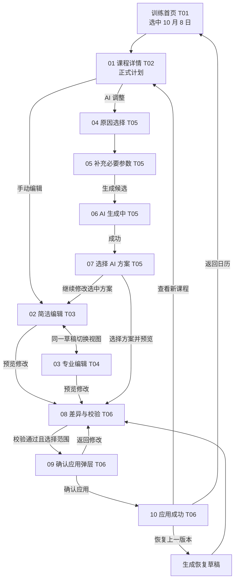

# 训练课程详情与编辑流程 · 流程确认稿

> 状态：**流程已确认，已据此制作设计稿与可点击原型**。本稿记录页面、数据与交互关系；已有 H01/T01/N01/A01/M01 和五栏原型保持不动。

## 1. 用户任务与范围

用户在 T01 训练日历选中 **2026 年 10 月 8 日（周四）**的课程，进入 T02 查看安排；若现实条件改变，可手动编辑，或用选项式 AI 引导生成候选。**两条支线都必须经过草稿、差异预览、校验和用户确认**，才产生新的正式计划版本。

本流程为一级「训练」下的深层页面，统一使用顶部返回、底部安全区操作栏，隐藏五栏底部导航。返回 T01 时保留原选中日期和滚动位置。

### 状态主线

`正式版本 v7 → 本课程草稿 → 手动修改 / AI 候选 → 待校验 → 可应用 / 需修改 / 不可应用 → 用户确认 → 正式版本 v8`。AI 候选只能写入草稿；应用成功后历史 v7 仍可追溯。恢复 v7 内容时生成**新的恢复提案**，确认后成为 v9，不抹去 v8 或审计记录。

## 2. 全流程统一示例数据

| 项目 | 值 / 依据 |
|---|---|
| 当前正式课程 | 10 月 8 日，公路车「耐力骑行」，60 分钟；与 H01/T01 一致 |
| 原始区段 | Z1 热身 10 分钟 + Z2 稳定骑行 45 分钟 + Z1 放松 5 分钟 = **60 分钟** |
| 原始目的 | 建立有氧基础；简洁说明「保持能完整说话的稳定节奏」 |
| 强度依据 | 示例档案 **FTP 未录入**；以主观强度 RPE 和通俗强度解释，不显示虚构的 W/FTP 百分比或 TSS |
| 本周正式安排 | 10 月 6 日 60 分钟 + 8 日 60 分钟 + 9 日 45 分钟 + 10 日 90 分钟 = **255 分钟（4 小时 15 分钟）** |
| 手动简洁分支示例 | 改为 **45 分钟**：Z1 5 + Z2 35 + Z1 5；目的仍为有氧基础，本周草稿合计 **240 分钟** |
| 手动专业分支示例 | 在原课中加入 `2 ×（节奏工作 4 分钟 RPE 6 + 恢复 3 分钟 RPE 2）`，稳定 Z2 缩至 31 分钟：10 + 14 + 31 + 5 = **60 分钟**；明确提示训练目的可能变化。该分支用于展示编辑器能力，不与手动简洁分支叠加 |
| AI 条件 | 选择「时间不够」→ 今天还可训练 **35 分钟**；不改变已有完成记录 |
| AI 方案 A（主演示） | **35 分钟耐力骑行**：Z1 5 + Z2 25 + Z1 5；保留有氧目的但训练量减少。本周草稿合计 **230 分钟（3 小时 50 分钟）** |
| AI 方案 B | **20 分钟轻松恢复骑行**：Z1 5 + Z1 10 + Z1 5；训练目的改为恢复，本周草稿合计 **215 分钟（3 小时 35 分钟）**，必须醒目标识目的变化 |
| 饮食关联 | N01 的正式饮食计划保持不变；时长变化只提示「今日骑行补给需复核」，不能悄悄改写餐食或实际进食记录 |

> 方案 A/B 是设计示例，具体训练建议必须在实现中结合用户资料和业务规则生成。专业编辑中的功率目标属于条件功能：若用户没有可靠功率输入，默认使用 RPE；可以看到切换入口与所需依据，但不得预填瓦数。具有可信功率基准的用户才可编辑 W 或 %FTP，并显示来源及测试日期。

## 3. 十个 Frame 的内容与跳转

### Frame 01 · 训练课程详情（T02）

- **进入条件**：T01 选中 10 月 8 日课程，点击「查看课程」；H01 今日训练亦可进入。
- **页面信息**：日期/时区、课程名称、正式计划标识、训练目的、60 分钟、主要强度 Z2/RPE 3–4、Z1/Z2 区段图（横轴为分钟、纵轴为相对强度；无功率基准时注明按 RPE 呈现）、10/45/5 分段说明、注意事项；简洁/专业视图切换读取同一结构数据。专业视图展开区段顺序、单位、RPE 定义及数据来源。
- **操作**：「手动编辑」→ 02、「AI 调整」→ 04。训练完成记录属于后续反馈流程，本原型不把尚未设计的记录页伪装为已接通功能。若课程已完成，编辑未来正式计划不得覆盖事实记录。
- **返回/取消**：顶部返回 T01，保留日期；详情页无未保存内容。
- **必要状态**：无 FTP 时显示 RPE 而非 W；已完成课程显示实际记录与计划分离；正式计划被其他操作更新时刷新版本提示。

### Frame 02 · 手动编辑：简洁视图（T03）

- **进入条件**：01 点「手动编辑」；07 选择 AI 方案后点「继续修改」也可带入同一草稿。
- **页面信息**：顶部「未应用草稿」、原课程摘要、日期/开始时间、可训练时长、难度档位（轻松/适中/较难）、训练方式（户外/室内）、保留训练目的开关、实时结构条和总时长。示例把 60 分钟改为 45 分钟，结构重算为 5/35/5。
- **操作**：「切换专业视图」→ 03，草稿数据不重置；「保存草稿」保留未应用状态；「预览修改」→ 08。目的无法保持时显示明确警示和建议修改方案。
- **返回/取消**：未保存变化时弹「继续编辑 / 保留草稿 / 放弃修改」；保留或放弃后回 01，正式 v7 不变。
- **必要状态**：日期与固定时间约束冲突时定位字段；时长过短导致热身/放松无法合理安排时阻止预览并说明可修正范围。

### Frame 03 · 手动编辑：专业视图（T04）

- **进入条件**：02 切换；或 01 记住用户的专业视图偏好后进入统一编辑器。
- **页面信息**：同一未应用草稿；按顺序列出热身、工作、恢复、稳定骑行、放松区段，可增删、复制、拖动排序。间歇组显示组数、每组工作时长/目标、恢复时长/目标；总时长和图区段实时派生。示例加入 2 组 4+3 分钟间歇并把 Z2 段缩至 31 分钟，总计仍 60 分钟，提示「有氧基础目的可能改变」。
- **功率编辑**：目标类型可选 RPE、心率或功率；当前示例 FTP 未录入，功率目标显示所需依据，不填造 W。若用户主动提供可信功率基准，W/%FTP 输入需有单位、范围、数据来源和校验。
- **操作**：「切换简洁视图」→ 02，不丢区段；「保存草稿」；「预览修改」→ 08。若简洁视图无法完整表达新结构，显示概述和「专业区段已保留」，不静默压平数据。
- **返回/取消**：与 02 共用未保存提示；返回时草稿按选择保留或放弃。
- **必要状态**：总时长等于展开后的所有区段和重复组时长之和；无效组数、零/负时长、超范围功率、缺少恢复段或排序冲突，定位到具体字段并阻止应用。

### Frame 04 · AI 调整原因选择（T05）

- **进入条件**：01 点「AI 调整」；也可从 A01 带课程上下文进入。
- **页面信息**：课程简要卡和五个大点击选项：时间不够、身体疲劳、天气原因、强度过高、其他原因。选择后只收集对应必要参数；「其他原因」才显示可选短文本。
- **操作**：选中原因后「下一步」→ 05；可返回 01。身体疲劳若涉及胸痛、晕厥等，先进入安全阻断状态，不继续普通高强度方案生成。
- **返回/取消**：返回 01，不生成草稿；若从未保存编辑器切入，先处理其未保存状态。
- **必要状态**：没有正式课程、无权限或课程已过期时不允许继续生成。

### Frame 05 · AI 参数补充（T05）

- **进入条件**：04 已选原因；主示例为「时间不够」。
- **页面信息**：所选原因、原计划 60 分钟、剩余可训练时间快捷选项 `20 / 30 / 35 / 45 分钟` 与自定义时长、是否只能今天完成等必要限制；其他原因切换对应字段，例如疲劳程度、室内条件或可改日期。只显示与本次原因有关的输入。
- **操作**：选择 35 分钟后「生成调整建议」→ 06；返回 04 可更改原因，保留已经填写的值。
- **返回/取消**：返回 04 或取消回 01，正式计划不变。
- **必要状态**：时间必须大于 0；若选择不少于原课 60 分钟，提示无需因时间不足缩短；若短到无法合理安排必要区段，提供取消或顺延等替代路径。无室内设备信息时不能默认安排室内骑行。

### Frame 06 · AI 生成中（T05）

- **进入条件**：05 校验输入后发起生成请求。
- **页面信息**：保留原课程和输入摘要；阶段提示依次为「读取课程与时间限制」「生成候选方案」「检查区段、冲突和饮食影响」。使用阶段状态，不显示没有依据的精确百分比。
- **操作**：生成成功 → 07；「取消生成」→ 05，保留输入；允许稍后返回时仅在后台任务确实支持的实现中出现。
- **返回/取消**：返回等同取消本次生成；不会修改正式计划，也不清除先前手动草稿。
- **必要状态**：超时、限流、模型错误、非法结构或安全拦截 → 失败/阻断状态；提供重试或手动编辑，正式 v7 不变。

### Frame 07 · AI 调整方案（T05）

- **进入条件**：06 返回 2 个通过基础结构检查的候选；更多候选最多 3 个。
- **页面信息**：每张卡显示课程类型、总时长、区段摘要、是否保留原目的、1 句理由和影响提醒。方案 A：35 分钟耐力骑行，5/25/5，保留目的；方案 B：20 分钟轻松恢复骑行，5/10/5，目的改变。两卡明确标「候选草稿 · 未应用」。
- **操作**：单选方案 A 后「预览该方案」→ 08；「继续修改」→ 02/03，在同一草稿内编辑所选方案；「重新选择条件」→ 05。
- **返回/取消**：返回 05 保留输入；取消建议回 01，正式计划不变。
- **必要状态**：只有 1 个有效候选时如实展示 1 个并说明原因；候选有警示可预览，阻断候选不可被选为可应用方案。

### Frame 08 · 训练计划差异对比（T06）

- **进入条件**：02/03 点「预览修改」，或 07 选方案后点「预览该方案」；恢复上一版时也使用本 Frame 的反向差异。
- **页面信息**：修改来源、正式 v7 与草稿、应用范围（默认「仅本节」，可切换「联动后续计划」并重新计算）、日期/时区、总时长 **60 → 35 分钟**、区段 **10/45/5 → 5/25/5**、主要强度仍 Z2、目的保留、本周总时长 **255 → 230 分钟**、下次测试和比赛影响（无变化则写「无」）、饮食补给需复核但不自动修改、风险/数据依据。
- **操作**：「继续修改」回来源页；「取消调整」保留或放弃草稿后回 01；「校验并继续」执行结构、训练规则、时间冲突、营养禁忌、权限及基础版本校验，全部通过 → 09。
- **返回/取消**：返回来源页并保留草稿；离开流程依草稿状态处理。选择联动后续计划时须展示全部受影响日期，不能只给聚合数字。
- **必要状态**：需修改时定位到具体课程/区段；阻断警示禁用继续；版本过期要求刷新正式计划并重新预览；估算值明确标示依据，不生成无来源的 TSS 或伤病风险结论。

### Frame 09 · 确认应用（T06 底部弹层）

- **进入条件**：08 校验通过，用户已明确选择应用范围。
- **页面信息**：弹层标题「确认应用这次调整？」，课程日期、选中方案、`60 → 35 分钟`、影响范围「仅 10 月 8 日本节」、饮食计划不自动变化、旧版本保留可恢复；若勾选营养变更，单独列出其差异与确认状态。
- **操作**：「确认应用」提交带 `base_plan_version` 和幂等键的申请 → 成功进入 10；「返回修改」关闭弹层回 08。提交中禁重复点击。
- **返回/取消**：点遮罩或系统返回关闭弹层，草稿仍保留，正式 v7 不变。
- **必要状态**：服务端再次校验；保存失败、版本冲突、网络中断留在 08/09 明确状态，不显示成功。若结果未知，先查询申请结果再允许重试，避免重复创建版本。

### Frame 10 · 应用成功（T06）

- **进入条件**：09 服务端确认新正式版本已完整写入且可读取。
- **页面信息**：新课程 **35 分钟耐力骑行**、生效日期、版本 **v8**、原 v7 已保留、受影响范围「仅本节」、补给仍按原正式饮食计划（如未应用营养调整）。
- **操作**：「查看新课程」→ 01，显示新正式数据；「返回训练日历」→ T01，周总时长更新为 230 分钟；「恢复上一版本」→ 生成恢复提案，进入 08 展示反向差异，经 09 确认后成为新版本 v9。
- **返回/取消**：系统返回到 T01 或 01；成功页不把「撤销」伪装成即时、无确认的覆盖操作。
- **必要状态**：若新版本读取暂不可用，显示同步中并允许重试，不把未确认的写入当作成功。

## 4. 五类额外交互状态

| 状态 | 触发 | 处理 / 去向 |
|---|---|---|
| 放弃编辑确认弹窗 | 02/03 有未保存变更时返回或关闭 | 「继续编辑」「保留草稿」「放弃修改」；后两项回 01。放弃只删除当前草稿，不影响正式 v7 |
| AI 生成失败 | 06 超时、限流、结构无效或模型不可用 | 保留 05 的输入和既有手动草稿；「重试生成」回 06，「手动编辑」到 02；正式计划不变 |
| 参数不合理警告 | 02/03 区段时长不合法、工作/恢复结构不完整、功率超范围，或 08 目的/冲突警示 | 字段级提示和修正建议；阻断项不能进入 09，非阻断项需用户在 08 明确认知 |
| 网络异常或保存失败 | 草稿保存、08 校验或 09 应用请求失败 | 显示失败位置、保留本地未提交输入；重试前核对服务端版本/申请状态，避免重复应用 |
| 恢复上一计划版本 | 10 或 S01 选择恢复 v7 内容 | 创建恢复草稿 → 08 反向差异与当前日期有效性校验 → 09 确认 → 新正式版本 v9；已完成的训练事实记录不回滚 |

## 5. 跨 Frame 交互约束

1. **双维度独立**：简洁/专业只改变编辑密度；手动/AI 只改变建议来源。它们共享一份课程草稿和同一套区段模型。
2. **正式/草稿明确**：01 和 T01 默认读正式版本；02–09 始终标「草稿/候选/未应用」；10 仅在应用成功后显示新正式版本。
3. **图文一致**：每次改动先更新区段数据，再派生总时长、区间图、简洁说明与差异；不得手改总时长却保持旧图。
4. **功率依据**：FTP 未录入时不显示具体 W/%FTP 目标或估算 TSS；专业编辑可选择目标类型，功率输入受可靠数据条件约束。RPE 术语提供解释。
5. **安全与权限**：健康异常优先于训练建议；所有应用前再次校验结构、冲突、饮食禁忌、权限和版本。危险建议不可通过改变按钮文案绕过。
6. **范围与版本**：`仅本节`与`联动后续计划`必须重新计算差异；营养变更如存在则可独立选择是否应用。重复提交只产生一个新版本。
7. **视觉体系**：390pt 基准，曜石黑/石墨灰/香槟金，深层页面顶部返回并按需固定底部操作栏，滚动内容留足安全区；主 CTA 金底深字，风险提示不只靠颜色。

## 6. 待确认的业务点与保守默认

| 待确认事项 | 本稿默认 |
|---|---|
| 无 FTP 时是否允许手动输入绝对 W 目标 | 仅在用户明确提供可测量的功率依据时开放；否则使用 RPE，不生成瓦数 |
| AI 生成任务是否支持离开后继续运行 | 当前只提供「取消生成」并返回参数页；不声称后台继续 |
| 首页/训练页是否直接展示未应用草稿 | 当前两者保留正式计划，并用独立提示卡进入差异预览 |
| 恢复版本的入口文案 | 用「恢复上一版本」进入提案与预览，不使用可能误导为立即生效的「一键撤销」 |

## 7. 下一阶段交付范围（本稿确认后）

- 10 张独立、真实 390pt 宽的暗色高保真 Frame；额外五类状态以弹层或独立变体呈现，不把全部页面塞进一张图。
- 可点击原型：至少覆盖 T01 → 01 → 手动/AI 两条路径 → 08 → 09 → 10，以及放弃、失败、阻断和恢复分支。
- 开发交接：组件、字段、校验、状态机、导航、接口状态、示例区段与版本变化说明。
